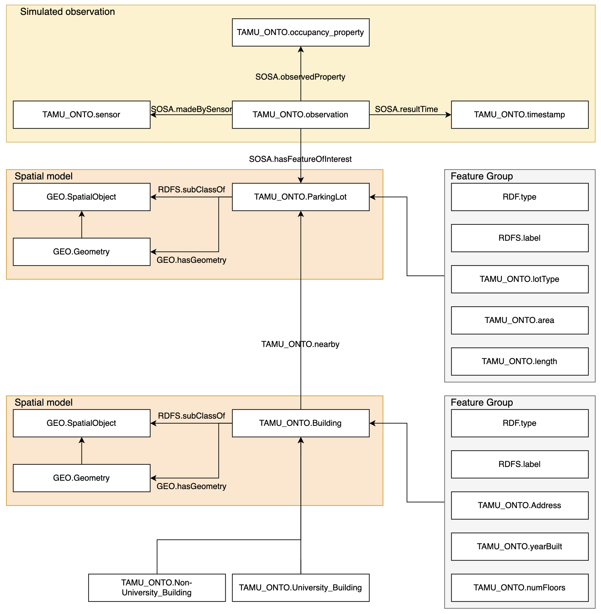
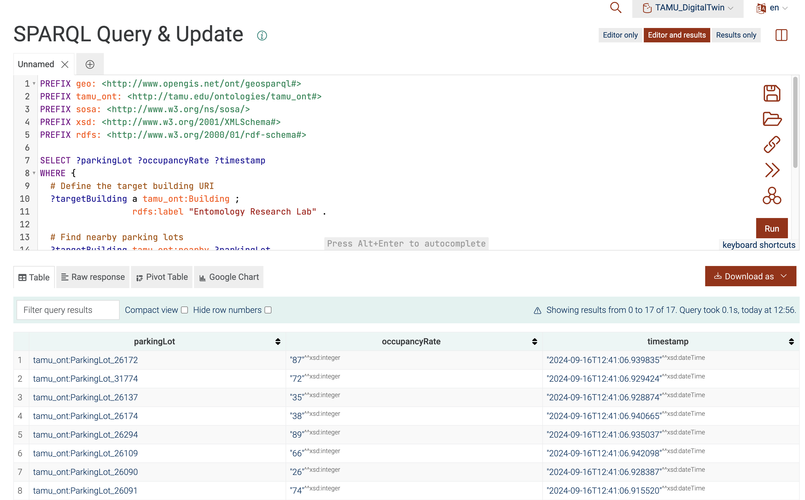

# Where to Park: Campus Digital Twin Knowledge Graph

This project aims to build and update a knowledge graph for a campus digital twin using geospatial data, focusing on searching for parking lots near target buildings and providing real-time occupancy rates. By periodically updating this information with simulated sensor data, the system supports drivers in finding available parking spaces and aids traffic planners in identifying areas of parking pressure, ultimately optimizing parking management and improving campus mobility.



## Project Structure

The project consists of the following Python scripts:

- `main.py`: The main script that orchestrates the entire workflow, including data acquisition, data processing, knowledge graph building, and periodic occupancy updates.
- `data_acquisition.py`: Handles data acquisition, fetching raw data files, and preparing them for further processing.
- `data_processing.py`: Processes the acquired GeoJSON files, preparing them for knowledge graph creation.
- `knowledge_graph_building.py`: Builds the knowledge graph (ontology) from processed data, using RDF triples, OWL classes, and properties to represent buildings and parking lots.
- `knowledge_graph_updating.py`: Periodically updates the occupancy rates in the knowledge graph using a scheduler.

## Workflow

1. **Data Acquisition** (`data_acquisition.py`): The process starts with acquiring and preparing the raw data files needed for building the knowledge graph.

2. **Data Processing** (`data_processing.py`): Processes the GeoJSON files (e.g., buildings and parking lots), transforming them into a format suitable for knowledge graph creation.

3. **Knowledge Graph Building** (`knowledge_graph_building.py`): This script creates an ontology using the processed data. It adds RDF triples for buildings and parking lots, defines relationships, and saves the resulting knowledge graph as an OWL file (`tamu_ont.owl`).

4. **Knowledge Graph Updating** (`knowledge_graph_updating.py`): This script periodically updates the occupancy rates in the knowledge graph using a simulated sensor. It uses a scheduler to perform the updates at defined intervals (default is 5 minutes).

5. **Main Execution** (`main.py`): Orchestrates the entire workflow. It runs the data acquisition, processing, knowledge graph creation, and starts the periodic updates.

## Getting Started

### Requirements

Ensure you have Python 3 installed. To install the necessary packages, run:

```
pip install -r requirements.txt
```
### Running the Project

To execute the entire workflow, run the `main.py` script:

```
python main.py
```

### Uploading to GraphDB

After running the workflow and generating the updated ontology (`tamu_ont.owl`), you need to upload this file to your GraphDB instance to keep your knowledge graph up-to-date.

1. **Locate the OWL File:** The ontology file `tamu_ont.owl` is saved in the `rdf_data` directory.
2. **Upload to GraphDB:** 
   - Log in to your GraphDB instance.
   - Navigate to the "Import" section and select the `tamu_ont.owl` file from your local directory.
   - Follow the GraphDB prompts to complete the upload.

### Example: Finding Nearby Parking Lots around Entomology Research Lab and Their Occupancy Rates

To search for parking lots surrounding Entomology Research Lab and retrieve their occupancy rates, you can use the following SPARQL query. This query assumes that the knowledge graph contains the relationships and properties for buildings, parking lots, and occupancy rates as described in your ontology.

#### SPARQL Query Example

```sparql
PREFIX geo: <http://www.opengis.net/ont/geosparql#>
PREFIX tamu_ont: <http://tamu.edu/ontologies/tamu_ont#>
PREFIX sosa: <http://www.w3.org/ns/sosa/>
PREFIX xsd: <http://www.w3.org/2001/XMLSchema#>
PREFIX rdfs: <http://www.w3.org/2000/01/rdf-schema#>

SELECT ?parkingLot ?occupancyRate ?timestamp
WHERE {
  # Define the target building URI
  ?targetBuilding a tamu_ont:Building ;
                  rdfs:label "Entomology Research Lab" .
  
  # Find nearby parking lots
  ?targetBuilding tamu_ont:nearby ?parkingLot .
  ?parkingLot a tamu_ont:ParkingLot ;
              geo:hasGeometry ?parkingGeometry .

  # Retrieve the latest occupancy rate for each parking lot
  ?observation a sosa:Observation ;
               sosa:hasFeatureOfInterest ?parkingLot ;
               sosa:observedProperty tamu_ont:OccupancyRate ;
               sosa:hasSimpleResult ?occupancyRate ;
               sosa:resultTime ?timestamp .
}
```
the answer will be like:



